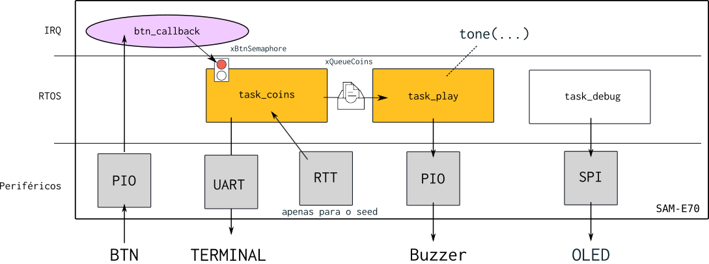
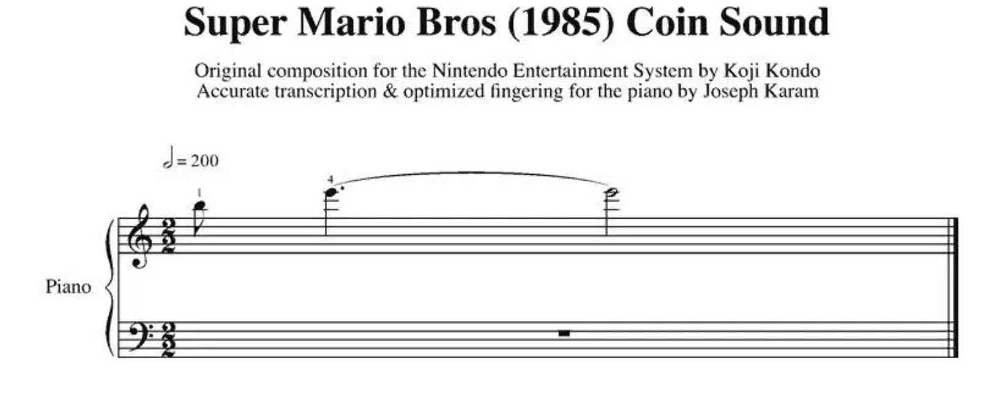

# 23b - AV1

- A prova é prática, com o objetivo de avaliar sua compreensão a cerca do conteúdo ministrado pela disciplina.
- É permitido consulta a todo material pessoal (suas anotações, códigos) e publico (github e internet, copilot e chatgpt), mas não pode consultar outros alunos.
- Realize um commit a cada 20 minutos!
- Duração total: 3 horas ( sem choro )
- **A interpretacao do que deve ser feito é parte da avaliação**

## Ideia


Nessa avaliação vocês irão recriar um brinquedo de um jogo de tabuleiro do banco imobiliário do Mário (peguei ideia brincando com os meus filhos), este jogo tem um dispositivo que quando apertado indica sonoramente quantas "moedas" o jogador irá ganhar (de forma aleatória). Toda vez que alguém aperta o botão sons são reproduzidos indicando se o jogador vai ganhar: UMA, DUAS ou TRÊS moedas.

Inspiracão:

https://www.youtube.com/shorts/klZNN5-Mb7w

Entrega final:

https://youtube.com/shorts/FMlfLhubCv4?feature=share

## Firmware

Vocês devem desenvolver o firmware como indicado a seguir:



- **O código base fornecido é o `RTOS-OLED-Xplained-Pro` já com o RTT adicionado no wizard.**

Filas e semáforos:

- `xBtnSemaphore`: Semáforo que indica que o botão foi apertado
- `xQueueCoins`: Fila de inteiros que recebe um valor entre `[1~3]` indicando quantas moedas o jogador ganhou

Tasks:

- `task_coins`: Task que recebe a informação que o botão foi pressionado e calcula quantas moedas o jogador vai ganhar, coloca esta informação na fila `xQueueCoins`.
- `task_coins`: Task que reproduz o som de acordo com quantas moedas vão ser oferecidas para o jogador.
- `task_debug`: Uma task que fica piscando uma bola no OLED, se a bolinha parar de piscar quer dizer que o código travou.

Periféricos:

- PIO: Para fazer a leitura do botão e acionar o buzzer.
- RTT: Vai ser usado para gerar o seed do gerador de números randômicos.
- UART: Para exibir os valores de debug! 

IRQ:

- Callback do botão 

### Gerador de números randômicos

Seria muito ruim se o dispositivo fornecesse sempre a mesma sequência de moedas, pois os jogadores poderiam compreender a dinâmica e antecipar o comportamento do sistema. Para evitar isso, podemos gerar uma sequência aleatória, de modo que, a cada vez que o jogador pressione o botão, o dispositivo produza uma sequência imprevisível para um ser humano.

Para gerarmos uma sequência aleatória, podemos utilizar a função `int rand(void)` disponível na lib `string.h`. Sempre que essa função é acionada, ela devolve um valor "aleatório" entre `0` e `RAND_MAX`. Contudo, o `rand` necessita ser inicializado com uma semente (`seed`) para produzir números distintos a cada inicialização.

> Você vai ter que limitar o resultado do `rand()` para operar entre [1~3].
>
> Pesquise no google como fazer isso.

A função `srand(int seed)` é responsável por inicializar o `rand()`, de modo que ele possa gerar sequências verdadeiramente aleatórias a cada vez que é chamado. Se sempre utilizarmos a mesma semente, a função `rand()` produzirá a mesma sequência de números aleatórios a cada inicialização. Portanto, uma prática comum é usar algum evento de tempo como semente (que dificilmente vai se repetir), garantindo assim que a sequência gerada seja diferente em execuções distintas.

> **O `srand` deve ser chamado apenas uma vez.**

#### Ideias para o seed

Podemos pensar em algumas soluções para gerarmos o `seed` do `srand`:

1. Tempo em que o sistema ficou ligado até o momento que o botão é apertado pela primeira vez
1. Tempo em que botão fica pressionado pela primeira vez

No final Você deve ter algo como:

```c 

srand(time); // Onde time é um interiro que depende de um fator externo imprevisível.

while(1){

    coins = rand() ....;

}
```

Onde o `time` é um valor que depende de um tempo externo e que é imprevisível e "único" cada vez. **O `time` deve ser calculado via uso do `RTT`.**

**Você pode escolher qual abordagem deseja usar.**

### Debug

Tando para quando o `seed` for gerando quanto para um número de moedas for processado, você deve imprimir no terminal: 

``` c
Seed : 123131
Coins: 1
Coins: 3
Coins: 3
...
...

```

### Som

A ideia é reproduzirmos um som similar ao utilizado no jogo do Mário para quando o personagem ganha uma moeda:



Ou seja, devemos reproduzir a nota `B5` por `1/8` do tempo e então o `E6` pelo resto do tempo para geramos o [som da moeda](https://www.youtube.com/watch?v=8OcSYRAhA9k):

```c
tone(NOTE_B5,  80);
tone(NOTE_E6, 640);
```

> Você vai precisar usar a sua função `tone()` da APS1 

#### `task_play`

Nesta task vocês devem usar a função `tone` e reproduzir o som da moeda, mas para isso funcionar direito vocês vão precisar aumentar a prioridade da task (por conta do `delay_us` que tem na função). 

**Aumente a prioridade da `task_play` para: **

``` c
(tskIDLE_PRIORITY + 1)
```

## Entrega

Um sistema é projetado para emitir o som de uma moeda aleatoriamente N vezes, com N variando entre os valores de 1 a 3. Para garantir a aleatoriedade na reprodução, o sistema utiliza uma semente (seed) gerada a partir de um evento temporal externo, que é calculado pelo RTT. A cada pressionamento de botão pelo jogador, o sistema emite o som da moeda correspondente ao número de pontos que o jogador acumulou.

### 📋 Check List: Funcionalidade

- [ ] **Reprodução do Som**: Ao apertar o botão, o som da moeda é reproduzido \( N \) vezes.
- [ ] **Aleatoriedade de \( N \)**: \( N \) é um valor aleatório entre `[1, 3]`.
- [ ] **Composição do Som**: O som é formado por duas notas distintas fornecidas anteriormente.
- [ ] **Sequência Aleatória**: A sequência de sons é renovada e aleatória a cada inicialização do sistema.

## 🛠️ Check List: Código

- [ ] Code Quality passando todos os testes!

- [ ] **Semente (`seed`)**: A semente é obtida através do `RTT`.
- [ ] **Tarefas**: O código possui duas tarefas: `task_coin` e `task_play`.
- [ ] **Inicialização do `srand`**: A `task_coin` inicializa o `srand` com o `seed` assim que disponível.
- [ ] **Leitura do Semáforo**: A `task_coin` verifica o semáforo `xBtnSemaphore`.
- [ ] **Geração de Número Aleatório**: A `task_coin` gera um valor aleatório entre `[1, 3]` e envia para a fila `xQueueCoins`.
- [ ] **Liberação do Semáforo**: O botão libera o semáforo `xBtnSemaphore` ao ser pressionado.
- [ ] **Recepção da Fila**: A `task_play` lê da fila um valor `n` que varia entre `[1, 3]`.
- [ ] **Reprodução do Som**: A `task_play` reproduz o som da moeda \( n \) vezes.
- [ ] **Utilização da Função `tone`**: A `task_play` faz uso da função `tone` para tocar as notas.
- [ ] **Debug no terminal do seed e do número gerado**
<!--
### Check list: funcionalidade

- [ ] Cada vez que o botão é apertado reproduz N vezes o som da moeda, onde 
- [ ] N é um valor aleatório entre `[1, 3]`
- [ ] Som é composto por duas notas 
- [ ] A sequência é aleatória para cada vez que o sistema é inicializado

### Check list: código

- [ ] Obtém uma `seed` usando o `RTT` 
- [ ] Possui duas `task`: `task_coin`, `task_play`
- [ ] `task_coin` inicializa o `srand` com o `seed` (quando obtido)
- [ ] `task_coin` lê o semáforo `xBtnSemaphore` e
- [ ] `task_coin` gera um número aleatório entre `[0,3]` e manda para a fila `xQueueCoins`
- [ ] `botão`: Botão libera o semáforo `xBtnSemaphore`
- [ ] `task_play`: Recebe da fila um valor `n` entre `[0, 3]
- [ ] `task_play`: Reproduz `n` vez a música da moeda
- [ ] `task_play`: Faz uso da função `tone`
-->
